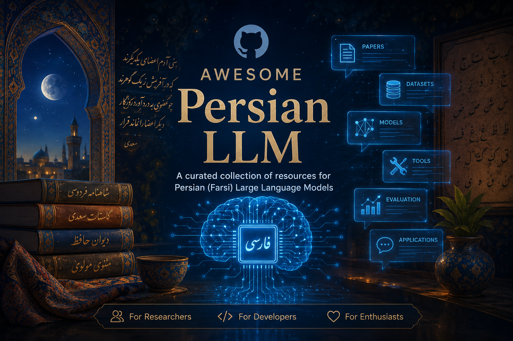

# Awesome Persian LLM

A curated list of **resources for Persian (Farsi) Large Language Models (LLMs)** including papers, datasets, models, tools, evaluation benchmarks, and practical applications.

This repository aims to collect everything related to **Persian NLP + LLMs** in one place for researchers, developers, and enthusiasts.

---

## 📑 Table of Contents

* [Papers & Research](#papers--research)

  * [LLM Development & Training](#llm-development--training)
  * [Evaluation & Benchmarks](#evaluation--benchmarks)
  * [Instruction Tuning & Alignment](#instruction-tuning--alignment)
  * [RAG Systems](#rag-systems--retrieval-augmented-generation)
  * [Culture & Linguistics](#culture-linguistics--language-behavior)
  * [Multilingual Studies](#multilingual--cross-lingual-studies)
  * [Datasets](#datasets--resources)
  * [Embedding Models](#embedding-models)
  * [Embedding Benchmarks](#embedding-benchmarks)
* [Models](#models)
* [Datasets](#datasets)
* [Tools & Libraries](#tools--libraries)
* [Evaluation & Benchmarks](#evaluation--benchmarks)
* [APIs & Platforms](#apis--platforms)
* [Articles & Blogs](#articles--blogs)
* [Contributing](#contributing)

---

## Papers & Research (Persian LLM Ecosystem)

### LLM Development & Training

* [Towards Building First Persian Large Language Model](https://arxiv.org/abs/2312.15713)
* [Persian-Phi: Efficient Cross-Lingual Adaptation of Compact LLMs via Curriculum Learning](https://arxiv.org/abs/2512.07454)
* [PersianMind: A Cross-Lingual Persian-English Large Language Model](https://arxiv.org/html/2401.06466v1)
* [A pretrained biomedical large language model for Persian biomedical text mining](https://www.nature.com/articles/s41598-026-55970-3)
* [Matina: A Large-Scale 73B Token Persian Text Corpus](https://arxiv.org/html/2502.09188v1)

---

### Evaluation & Benchmarks

* [Benchmarking Open-Source Large Language Models for Persian in Zero-Shot and Few-Shot Learning](https://arxiv.org/html/2510.12807v1)
* [Benchmarking Large Language Models for Persian](https://arxiv.org/html/2404.02403v1)
* [Advancing Persian LLM Evaluation](https://aclanthology.org/2025.findings-naacl.147.pdf)
* [MELAC: Massive Evaluation of Large Language Models](https://aclanthology.org/2025.ijcnlp-long.105.pdf)
* [ELAB: Extensive LLM Alignment Benchmark in Persian Language](https://arxiv.org/abs/2504.12553)
* [EPT Benchmark: Evaluation of Persian Trustworthiness in Large Language Models](https://www.isecure-journal.com/article_242935.html)
* [Khayyam Challenge PersianMMLU: Is Your LLM Truly Wise to The Persian Language?](https://openreview.net/forum?id=yIEyHP7AvH)
* [PARSE: An Open-Domain Reasoning Question Answering Benchmark for Persian](https://www.researchgate.net/publication/400371023_PARSE_An_Open-Domain_Reasoning_Question_Answering_Benchmark_for_Persian)
* [PerCoR: Evaluating Commonsense Reasoning in Persian via Multiple-Choice Sentence Completion](https://arxiv.org/html/2510.22616v1)
* [PERCUL: A Story-Driven Cultural Evaluation of LLMs in Persian](https://aclanthology.org/2025.naacl-long.631.pdf)
* [One Language, Three of Its Voices: Evaluating Multilingual LLMs Across Persian, Dari, and Tajiki](https://aclanthology.org/2026.silkroadnlp-1.10.pdf)

---

### Instruction Tuning & Alignment

* [Empowering Persian LLMs for Instruction Following](https://aclanthology.org/2025.loreslm-1.3/)
* [FarsInstruct: Empowering Large Language Models for Persian Instruction Understanding](https://arxiv.org/html/2407.11186v1)
* [Evaluating LLM-Generated Persian Questions for Teaching Conditional Programming Using Bloom’s Taxonomy](https://ieeexplore.ieee.org/document/10843532)

---

### RAG Systems & Retrieval-Augmented Generation

* [PersianRAG: A Retrieval-Augmented Generation System for Persian Language](https://arxiv.org/abs/2411.02832)
* [FARSIQA: Faithful Advanced RAG System for Islamic Question Answering](https://openreview.net/forum?id=TP1sKVHGY5)
* [TekRAG-Persian: A Data-Centric Benchmark for Reducing Hallucination in Persian Technical QA](https://www.teknav.ir/article/tekrag-persian-data-centric-rag-benchmark)
* [Leveraging Retrieval-Augmented Generation for University Knowledge Retrieval](https://arxiv.org/html/2411.06237v1)

---

### Culture, Linguistics & Language Behavior

* [We Politely Insist: Your LLM Must Learn the Persian Art of Taarof](https://aclanthology.org/2025.emnlp-main.94.pdf)
* [Large Language Models for Persian-English Idiom Translation](https://aclanthology.org/2025.naacl-long.405/)
* [Predictive typing for the Persian language: A survey](https://www.sciencedirect.com/science/article/abs/pii/S095219762502490X)

---

### Multilingual & Cross-Lingual Studies

* [Persian-Phi: Efficient Cross-Lingual Adaptation](https://arxiv.org/abs/2512.07454)
* [PersianMind: A Cross-Lingual Persian-English LLM](https://arxiv.org/html/2401.06466v1)
* [One Language, Three of Its Voices (Persian, Dari, Tajiki)](https://aclanthology.org/2026.silkroadnlp-1.10.pdf)

---

### Datasets & Resources

* [Matina: A Large-Scale 73B Token Persian Text Corpus](https://arxiv.org/html/2502.09188v1)

---

## Embedding Models

* [Hakim: Farsi Text Embedding Model](https://arxiv.org/abs/2505.08435)
* [Tooka-SBERT: Lightweight Sentence Embedding Models for Persian](https://aclanthology.org/2025.findings-ijcnlp.147.pdf)

---

## Embedding Benchmarks

* [FaMTEB: Massive Text Embedding Benchmark in Persian Language](https://arxiv.org/pdf/2502.11571)

---

## Models

- [Dorna-Llama3-8B-Instruct-GGUF](https://huggingface.co/PartAI/Dorna-Llama3-8B-Instruct-GGUF)
- [PartAI Dorna-Llama3: The most powerful Persian LLM to date, under 10B parameters](https://ollama.com/partai/dorna-llama3)
- [PersianMind-v1.0](https://huggingface.co/universitytehran/PersianMind-v1.0)
- [Persian-llm-fibonacci-1-7b-chat.P1_0](https://www.promptlayer.com/models/persian-llm-fibonacci-1-7b-chatp10/)
- [gemma3persian](https://ollama.com/mshojaei77/gemma3persian)
- [AVA-Llama-3-V2 ](https://huggingface.co/MehdiHosseiniMoghadam/AVA-Llama-3-V2)
- [persian_llama_7b](https://huggingface.co/mostafaamiri/persian_llama_7b)
- [MaralGPT/Maral-7B-alpha-1](https://huggingface.co/MaralGPT/Maral-7B-alpha-1)
- [alpaca-persian](https://huggingface.co/datasets/sinarashidi/alpaca-persian)
- [Dorna-Llama3-8B-Instruct-Quantized4Bit](https://huggingface.co/amirMohammadi/Dorna-Llama3-8B-Instruct-Quantized4Bit)
---

## Repos

- [Persian-Ollama-LLm](https://github.com/sepy-dev/Persian-Ollama-LLm)
- [Promptwright - Synthetic Dataset Generation Library, Persian Version](https://github.com/ParsBench/Persian-PromptWright)
- [AVA-Llama-3](https://github.com/mehdihosseinimoghadam/AVA-Llama-3)
- [Persian RAG System](https://github.com/mehdighelich1379/persian-rag-system)
- [RAG Langchain Persian](https://www.kaggle.com/code/skhalili/rag-langchain-persian)
- [Artificial Intelligence Projects](https://github.com/omid-sakaki-ghazvini/Projects/tree/main)
- [llm-for-humans](https://github.com/3lf/llm-for-humans)
- [RAG_system_using_Wikipedia](https://github.com/omid-sakaki-ghazvini/Projects/blob/main/RAG_system_using_Wikipedia.ipynb)
--- 

## Datasets

- [Persian Poetry Dataset for NLP & LLM Tasks](https://github.com/mohammadreza-mohammadi94/Persian-Poem-Dataset)
- [Pre-trained Language Models](https://nlpdataset.ir/farsi/pre-trained_lm.html)
- [Targoman TLPC](https://huggingface.co/datasets/Targoman/TLPC)
- [Persian News Dataset](https://www.kaggle.com/datasets/amirzenoozi/persian-news-dataset)
- [synthetic-persian-chatbot-rag-summary-retrieval ](https://huggingface.co/datasets/MCINext/synthetic-persian-chatbot-rag-summary-retrieval)
---

## Evaluation & Benchmarks

- [Open Persian LLM Leaderboard](https://huggingface.co/spaces/PartAI/open-persian-llm-leaderboard)
- [Persian LLM Leaderboard](https://huggingface.co/spaces/MatinaAI/persian_llm_leaderboard)
- [🇮🇷 MIZAN: A Persian LLM Leaderboard](https://mcinext-mizan-llm-leaderboard.hf.space/)
- [ParsBench](https://github.com/ParsBench/ParsBench)

---

## APIs & Platforms

- [AvvalAI](https://avalai.ir/)
- [GapGPT](https://gapgpt.app/)
- [liara](https://liara.ir/products/ai/)
- [roboo](https://roboo.ir/)
- [ivira](https://ivira.ai/chatbot/)
---

## Articles & Blogs

- [Maral is here, 7 billion parameters bilingual model with support of Persian!](https://haghiri75.com/en/maral-is-here-7-billion-parameters-bilingual-model-with-support-of-persian/)
- [Fine-Tuning a Large Language Model for Persian: Our Company’s Journey](https://medium.com/@info.ahdsoft/fine-tuning-a-large-language-model-for-persian-our-companys-journey-20aedcc9c13f)
- [The Widening Gap: Persian Language in the Age of Large Language Models](https://www.linkedin.com/pulse/widening-gap-persian-language-age-large-models-mehrdad-zaker-waevc/)
- [Deep Dive into a Persian QA Task](https://medium.com/@marziehsepehr/deep-dive-into-a-persian-qa-task-eb41b050caaa)
- [Create a QA System in Persian with RAG](https://avalai.ir/blog/comprehensive-training-on-creating-with-rag/)
- [How five AI models source Iran-related information in Persian](https://www.gazzetta.xyz/iran-persian-ai-model-compared/)
---

## Persian Blogs Posts 
- [Intro to vLLM](https://virgool.io/@Mohi72/%D8%A8%D8%A7-vllm-%D9%BE%D9%85%D9%BE%D8%A7%DA%98-%D8%AE%D9%88%D9%86%DB%8C-%D8%AA%D8%A7%D8%B2%D9%87-%D8%AF%D8%B1-llm%D9%87%D8%A7-%D8%A8%D8%B1%D8%A7%DB%8C-%D8%A7%D9%81%D8%B2%D8%A7%DB%8C%D8%B4-%D8%B3%D8%B1%D8%B9%D8%AA-%D9%BE%D8%A7%D8%B3%D8%AE-%D8%AF%D9%87%DB%8C-%D9%88-%D8%AA%D9%88%D8%A7%D9%86-%D9%BE%D8%B1%D8%AF%D8%A7%D8%B2%D8%B4%DB%8C-zzffhtjfzcor)

---

## Contributing

Contributions are welcome!

If you know any useful resource related to Persian LLMs, feel free to:

1. Fork the repo
2. Add your resource
3. Submit a pull request

Please keep entries clean and categorized properly.

---

## License

This project is licensed under the **MIT License**.

---

## Why this repo?

Persian is still an underrepresented language in the LLM ecosystem.  
This repo aims to make it easier to build, train, and deploy **high-quality Persian AI systems**.